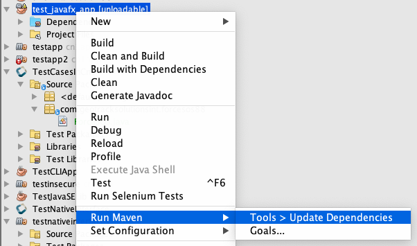
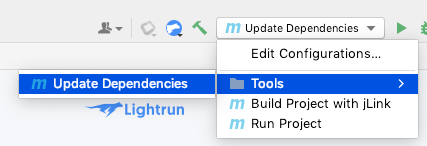
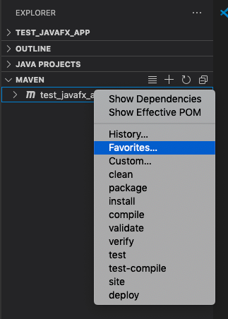
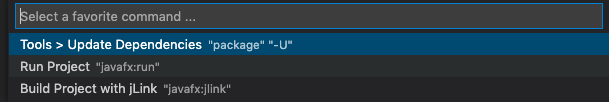

= MVNConfig

A developer-friendly tool for integrating Maven projects into IDEs.

== Synopsis

Maven makes it easy to manage Java project dependencies, and manage the build process.  However, it doesn't provide a standard way for IDEs to plug into top-level tasks for initiating commonly-used tasks on a project.  If your project includes custom build targets (e.g. "Start Server" or "Submit build to Cloud Build", etc...), you will need to define these tasks separately for each IDE.

For example, NetBeans provides the "nbactions.xml" file, which allows you to customize the build, run, debug, and test actions, as well as define alternate configurations for these actions.  IntelliJ stores comparable run configurations in its ".idea/workspace.xml" file.  VSCode has its own configuration files to help integrate Maven projects in its ".vscode" directory.  Every IDE has its own way.

The ideal solution to this problem would be to create a standard configuration format that all IDEs support, but, since that doesn't exist right now, the next best approach is to create a common configuration format from which the formats for all IDEs can be generated.  That's what _mvnconfig_ does.

== How it works

Place a file named _mvnconfig.toml_ in your project's root directory, which defines the tasks that should be associated with your project.  The run `mvnconfig` to generate the IDE-specific configuration files, so that, if you open the project any any of the supported IDEs, it will provide run configurations, actions, favorites, etc.. to be able to perform these tasks.

== Example _mvnconfig.toml_

.Configuration with two tasks: "run-javafx" and "jlink".
[source,toml]
----
[run-javafx]
label=Run JavaFX App
command=["mvn", "javafx:run"]
run=true

[jlink]
label="Build with jlink"
command=["mvn", "javafx:jlink"]
build=true
----

== Project Status

Under development.  _mvnconfig_ is in early stages of development.  It will currently generate configurations for NetBeans, IntelliJ, and VSCode only - and the syntax is still in flux.

== Installation

Installation requires that you have a recent version of _npm_ installed, which comes bundled with NodeJS, which can be downloaded https://nodejs.org/en/download/[here].

Run the following command.  (NOTE:  Will require `sudo` on Mac and Linux).

[source,listing]
----
npm install -g mvnconfig
----

== Usage

CLI usage instructions can be found by simply running `mvnconfig` with no parameters:

[source,listing]
----
Usage: mvnconfig [-hV] [-f=<mvnConfigFile>] -i=<ide> <projectDirectory>
      <projectDirectory>   Target Project directory
  -f, --mvnconfig=<mvnConfigFile>
                           Path to mvnconfig.toml file
  -h, --help               Show this help message and exit.
  -i, --ide=<ide>          Output options: IntelliJ, NetBeans, Eclipse, VSCode
----

If `<projectDirectory>` is omitted, it will default to the current working directory.

For the purpose of the following example usages, let's begin by generating a simple JavaFX project using its archetype.

[source,bash]
----
mvn archetype:generate \
        -DarchetypeGroupId=org.openjfx \
        -DarchetypeArtifactId=javafx-archetype-simple \
        -DarchetypeVersion=0.0.3 \
        -DgroupId=ca.weblite.test \
        -DartifactId=test_javafx_app \
        -Dversion=1.0.0 \
        -Djavafx-version=17.0.1 \
        -DinteractiveMode=false
----

If this succeeds, create a file named "mvnconfig.toml" inside the root directory of the project we just generated.

[source,toml]
----
[run]
label="Run Project"
command=["$mvn$", "javafx:run"]
run=true

[jlink]
label="Build Project with jLink"
command=["$mvn$", "javafx:jlink"]
build=true

[update]
label="Update Dependencies"
command=["$mvn$", "package", "-U"]
group="Tools"
----

=== Generate NetBeans Configuration

Run the following command in the project directory contaning the mvnconfig.toml file.

[source,listing]
----
mvnconfig -i NetBeans
----

Now open the project in NetBeans, and you should see the extra build options.

NOTE: Only the "Update Dependencies" action shows up in the _Run Maven_ menu.  The "Build" and "Run" actions we created do not show up here.  This is because those actions where marked as `build=true` and `run=true` respectively, so they are mapped to the project's default "Build" and "Run" buttons in NetBeans.

=== Generate IntelliJ Configuration

Run the following command in the project directory contaning the mvnconfig.toml file.

[source,listing]
----
mvnconfig -i IntelliJ
----

Now open the project in IntelliJ and you should see the run configurations.

=== Generate VSCode Configuration

Run the following command in the project directory contaning the mvnconfig.toml file.

[source,listing]
----
mvnconfig -i VSCode
----

Now open the project in VSCode, and you should have the build options listed in favourites.

You'll find these actions in the _Favourites_ menu, which you access by expanding the "maven" panel, then, inside the expanded _maven_ panel, right-clicking your project, and selecting "Favorites..."

This will open the Favourites menu, which will include the tasks you defined in your mvnconfig.toml file.

== mvnconfig.toml Syntax

The `mvnconfig.toml` file uses https://toml.io/en/[TOML] because of its simplicity.  You should define a section for each task that you want to associate with the project.  The section name will be the default task label in the corresponding IDE menu.

You may include `run`, `build`, and `debug` boolean properties in each section to cause the task to bind to the IDE's default run/build/debug actions if supported.  (Currently only NetBeans supports this).

Each task must define a `command` property, which is a list of command-line arguments that are passed to Maven.

Available properties include:

label::
The label for the action.  This will be used as the menu label for running the action in the IDE.

command::
A list of command-line arguments to pass to `mvn` for running this task.

run::
A boolean (`true` or `false`) indicating whether this is a "run" command.  Run commands will be mapped to the IDE's default "run" command on supported IDEs.  Currently only NetBeans supports this.

build::
A boolean (`true` or `false`) indicating whether this is a "build" command.  Build commands will be mapped to the IDE's default "build" command on supported IDEs.  Currenly only NetBeans supports this.

debug::
A boolean (`true` or `false`) indicating whether this is a "debug" command.  Run commands will be mapped to the IDE's default "run" command on supported IDEs.  Currently only NetBeans supports this.

group::
Optional string with a "group" label that can be used to group multiple commands together.  On IntelliJ this will create a folder for the group in the _Run Configurations_ menu.  On NetBeans and VSCode, the group will be prefixed to the menu label for the task.

== Credits

Created by https://sjhannah.com[Steve Hannah]